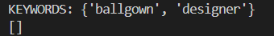
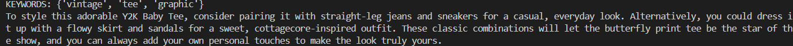
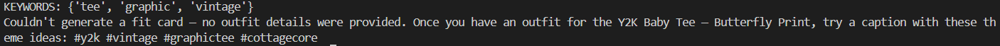

# FitFindr — README

## Tool Inventory 
### Tool 1: `search_listings(description: str,size: str | None = None,max_price: float | None = None,) -> list[dict]`

**What it does:**
<!-- Describe what this tool does in 1–2 sentences -->
This tool searches through the mock listings and returns the top matches based on what the user requested (description, size, max price). It returns the matching listings sorted by relevance. 

**Input parameters:**
<!-- List each parameter, its type, and what it represents -->
- `description` (str): keywords describing the item users want 
- `size` (str): desired clothing size (must match)
- `max_price` (float): max amount user is willing to spend

**What it returns:**
<!-- Describe the return value — what fields does a result contain? -->
It returns a list of one or more listing dictionaries.
```
{
    "id": (str),
    "title": (str),
    "description": (str),
    "category": ,
    "style_tags": list of (str),
    "size": (str),
    "condition": (str),
    "price": float,
    "colors": list of (str),
    "brand": (str),
    "platform": (str)
  },
```
The first item if there are multiple, should be the user's top rated item based on the search criteria. 
If no matches are found, an empty list is returned. 

**What happens if it fails or returns nothing:**
<!-- What should the agent do if no listings match? -->
If no listings match the query criteria, the agent informs the user that no matches were found and recommend the user to modify their search criteria. The workflow should not advance to outfit generation.

---

### Tool 2: `suggest_outfit(new_item: dict, wardrobe: dict) -> str`

**What it does:**
Generates one or more outfit recommendations using the top rated selected item from the listings search (previous tool output) and items from the user's wardrobe.

**Input parameters:**
<!-- List each parameter, its type, and what it represents -->
- `new_item` (dict): first item in the list of dict selected from search results from ``` search_listings``` in ```tools.py```
- `wardrobe` (dict): The user's wardrobe information following the provided wardrobe schema (examples in ```data/wardrobe_schema.json```)

**What it returns:**
1 Outfit suggestions describing how to style the selected item along with pieces in the user's wardrobe information in 1-2 sentence string


Example: "Pair this with your wide-leg jeans and platform Docs for a classic 90s grunge look. Roll the sleeves once and tuck the front corner slightly for shape."

**What happens if it fails or returns nothing:**
<!-- What should the agent do if the wardrobe is empty or no outfit can be suggested? -->
If the wardrobe is empty or contain very few items, the agent should generate generic styling recommendation with common clothing items instead of wardrobe-specific suggestions. Be sure to specify the item suggested (in this case) are general recommendation rather than wardrobe. 

---

### Tool 3: `create_fit_card(outfit: str, new_item: dict) -> str`

**What it does:**
<!-- Describe what this tool does in 1–2 sentences -->
Creates a short social-media-style caption describing the complete outfit and highlighting the newly selected item. 

**Input parameters:**
<!-- List each parameter, its type, and what it represents -->
- `outfit` (str): outfit recommendation generated by `suggest_outfit` from `tools.py`
- `new_item` (dict): clothing item selected from search results from ``` search_listings``` in ```tools.py```

**What it returns:**
A short caption suitable for sharing on social media. Should be a one-liner and catchy. Feel free to include hashtags 

**What happens if it fails or returns nothing:**
If the outfit information is missing or incomplete, the agent informs the user that a fit card could not be generated and returns the outfit recommendation without a caption. Instead, offer some hastags/theme that could be relevant to a theme. 

---
## Planning Loop
1. Extract the clothing description, size, and maximum price from the user's query. The user's wardrobe is assumed to be provided as part of the initial request or loaded into session state before outfit generation.
    - If description is missing, ask user for clarification.
    - If size is missing, continue search without a size filter
    - If max_price is missing, use no price limit
2. If -  above 3 parameters present, then call `search_listing`
3. Else - Request the user to be more specific, and mention 3 criteria and go back to item 1 
4. If `search_listing` returns atleast 1 item in format specified above (see tool 2 block)
    - store the highted-ranking listing as the selected item 
5. If `search_listing` returns no results
    - inform user that no items were found, suggest to modify search criteria, stop workflow 
6. Call `suggest_outfit` using the selected item and the user's wardrobe 
7. If user's wardrobe is empty/minimal
    - create a generic outfit recommendation 
8. Else
    - create a wardrobe-specific recommendation (must mention another item present in user wardrobe directly)
9. Call `create_fit_card` using outfit recommendation and selected item  
10. If card generation fails
    - return outfit recommendation without fit card, and give user some hashtags or ideas on how to make their own caption 
11. Else
    - return the selected listing, outfit recommendation, and the fit card
12. End workflow 


---
## State Management 
**How does information from one tool get passed to the next?**
<!-- Describe how your agent stores and accesses state within a session. What data is tracked? How is it passed between tool calls? -->
The agent maintains session state in the following dictionary through the entire interaction/session
```
{
     selected_item: (dict)
     {
          "id": (str),
          "title": (str),
          "description": (str),
          "category": ,
          "style_tags": list of (str),
          "size": (str),
          "condition": (str),
          "price": float,
          "colors": list of (str),
          "brand": (str),
          "platform": (str)
     },
     selected_outfit: (str),
     wardrobe: (json) reference data/wardrobe_schema.json for examples
     fit_card: (str)
}
```

The result of `search_listing` first ranked item --> is stored as selected_item. That item gets passed to `suggest_outfit`. The outfit recommendation produced by tool #2 is stored as selected_outfit and passed to `create_fit_card`. This allows the tools to reuse info without requiring the user to enter it multiple times. 

---
## Error Handling Strategy 
For each tool, describe the specific failure mode you're handling and what the agent does in response.

| Tool | Failure mode | Agent response |
|------|-------------|----------------|
| search_listings | No results match the query | Inform user that no matches were found, and recommend chaning their search filters|
| suggest_outfit | Wardrobe is empty | Generate a generic outfit recommendation using common clothing pieces instead|
| suggest_outfit | Wardrobe doesn't have anything that matches item | Mention this is style different than wardrobe, recommend a matching outfit recommendation using common clothing pieces that pair well with new item instead |
| create_fit_card | Outfit input is missing or incomplete | Inform the user that a fit card couldn't be generated, return the outfit recommendation + some themes/hashtags that would be relevant instead of complete caption|

---
## Testing Individual Tool Failure 
1. Trigger `search_listings` returning zero results
   - Input: 
    ``` 
    python -c "from tools import search_listings; print(search_listings('designer ballgown', size='XXS', max_price=5))"
    ```
   - Output: 
   
   

2. Trigger `suggest_outfit ` returning empty wardrobe
   - Input: 
    ``` 
    python -c "
    from tools import search_listings, suggest_outfit
    from utils.data_loader import get_example_wardrobe, get_empty_wardrobe
    results = search_listings('vintage graphic tee', size=None, max_price=50)
    print(suggest_outfit(results[0], get_empty_wardrobe()))
    "
    ```
   - Output: 
   
    

3. Trigger `create_fit_card` with empty outfit string:
   - Input: 
    ``` 
    python -c "
    from tools import search_listings, create_fit_card
    results = search_listings('vintage graphic tee', size=None, max_price=50)
    print(create_fit_card('', results[0]))
    "
    ```
   - Output: 
   
    

## Spec Reflection

<!-- Reflect on how planning.md shaped your implementation.
     Answer both questions with at least 2–3 sentences each. -->

**One way the spec helped you during implementation:** The spec helped breakdown the larger task into actionable and testable smaller sections. It helped me frame my thinking to prioritize edge cases early on which made debugging easier throughout. The unit tests and individual testing also saved a lot of time in the long run since I caught minor bugs during those stages. State management is also very important which was emphasized through the spec. 

**One way your implementation diverged from the spec, and why:** Although the major edge cases were covered, I also brainstormed and covered a few others. For example, how exactly to gracefully recover from no caption given (give generic hashtags rather than no result). For testing, I also interfaced with the debugger to track state management since I found that to be the most effective way to track changes as they happened. 

---

## AI Usage

<!-- Describe at least 2 specific instances where you used an AI tool during this project.
     For each: what did you give the AI as input, what did it produce, and what did you
     change, override, or direct differently?

     "I used Claude to help me code" is not sufficient.
     "I gave Claude my Chunking Strategy section from planning.md and asked it to implement
     chunk_text(). It returned a function using a fixed character split. I overrode the
     chunk size from 500 to 200 because my documents are short reviews, not long guides." -->

**Instance 1**

- *What I gave the AI:* I gave to-do instructions for `search_listings` to go from query to relevant matches. 
- *What it produced:* Originally, it produced matches result that were irrelevant to some of the queries tested. 
- *What I changed or overrode:* I analyzed how the tokenize code was produced and realized that characters in conjunction produced single char which caused bad matches. For examples, don't -> 'don' and 't' and 't' got a lot of matches. I added more conditions on how to tokenize. 

**Instance 2**

- *What I gave the AI:* I provided an AI tool with the Planning Loop and State Management sections from my planning.md
- *What it produced:* A sequential call to all 3 rools, where intermediate results were stored in the session
- *What I changed or overrode:* I reviewed the code, and mdofiied to ensure that the agent branched correctly by settings sessions["error"] with a specific error and returning early.  


## Given Materials 
### What's Included

```
ai201-project2-fitfindr-starter/
├── data/
│   ├── listings.json          # 40 mock secondhand listings
│   └── wardrobe_schema.json   # Wardrobe format + example wardrobe
├── utils/
│   └── data_loader.py         # Helper functions for loading the data
├── planning.md                # Your planning template — fill this out first
└── requirements.txt           # Python dependencies
```

### Setup

```bash
pip install -r requirements.txt
```

Set your Groq API key in a `.env` file (get a free key at [console.groq.com](https://console.groq.com)):
```
GROQ_API_KEY=your_key_here
```

### The Mock Listings Dataset

`data/listings.json` contains 40 mock secondhand listings across categories (tops, bottoms, outerwear, shoes, accessories) and styles (vintage, y2k, grunge, cottagecore, streetwear, and more).

Each listing has: `id`, `title`, `description`, `category`, `style_tags`, `size`, `condition`, `price`, `colors`, `brand`, and `platform`.

Load it with:
```python
from utils.data_loader import load_listings
listings = load_listings()
```

### The Wardrobe Schema

`data/wardrobe_schema.json` defines the format your agent uses to represent a user's existing wardrobe. It includes:

- `schema`: field definitions for a wardrobe item
- `example_wardrobe`: a sample wardrobe with 10 items you can use for testing
- `empty_wardrobe`: a starting template for a new user

Load an example wardrobe with:
```python
from utils.data_loader import get_example_wardrobe
wardrobe = get_example_wardrobe()
```

### Where to Start

1. **Read `planning.md` and fill it out before writing any code.**
2. Verify the data loads correctly by running `python utils/data_loader.py`.
3. Build and test each tool individually before connecting them through your planning loop.

Your implementation files go in this same directory. There's no required file structure for your agent code — organize it however makes sense for your design.